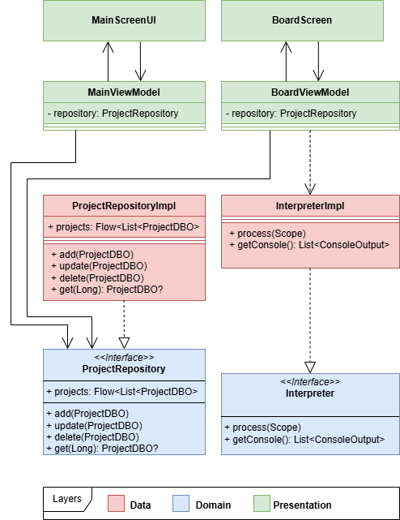
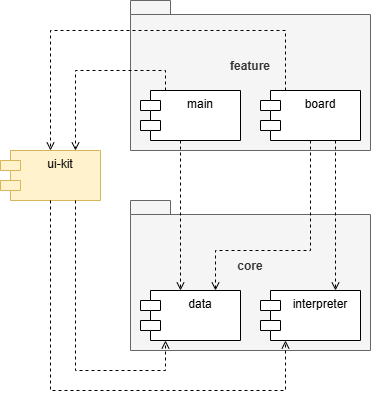

# Модуль 7. Codeblock

 |
### Используемые технологии

<b>Cписок технологий</b>

| Технология    | Версия   |
|---------------|----------|
| Kotlin        | `2.0.21` |
| Compose       | `1.8.0`  |
| DataStore     | `1.1.7`  |
| Serialization | `2.1.0`  |
| JUnit         | `4.13.2` |

|                                                                                |                                                                           |
|--------------------------------------------------------------------------------|---------------------------------------------------------------------------|
| 

 | 

 |