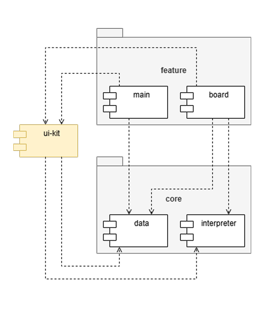

# Модуль 7. Codeblock

<b>Используемые технологии</b>

 

| Технология    | Версия   |
|---------------|----------|
| Kotlin        | `2.0.21` |
| Compose       | `1.8.0`  |
| DataStore     | `1.1.7`  |
| Serialization | `2.1.0`  |
| JUnit         | `4.13.2` |

<b>Диаграмма зависимостей</b>

    
 

|                              Архитектура                                       |                              Модули                                       |
|--------------------------------------------------------------------------------|---------------------------------------------------------------------------|
| 

 | 

 |

